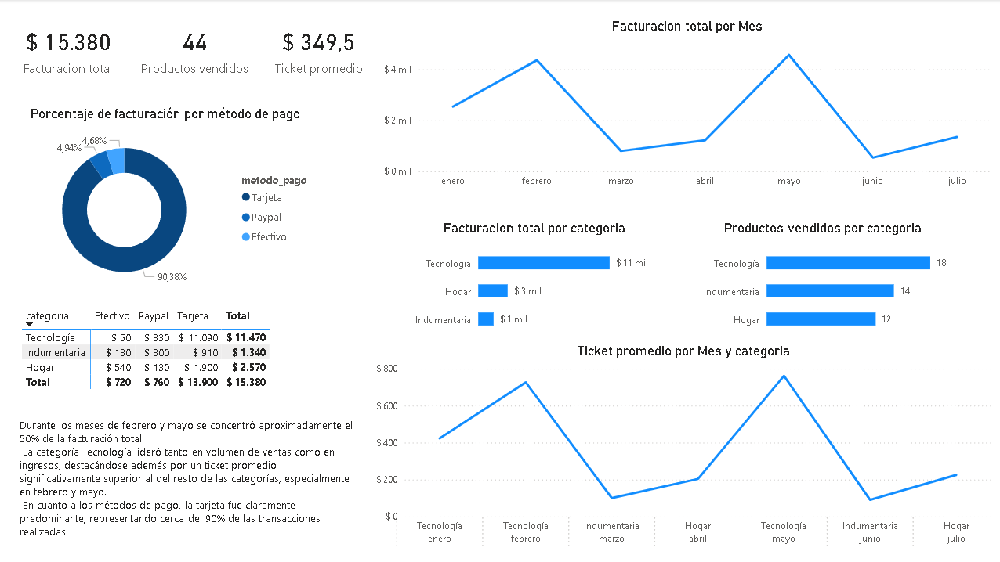

# analisis-ventas-sql
Análisis sobre un conjuntos de datos de ventas para identificar patrones de facturación, productos y categorías más relevantes, comportamiento mensual y métodos de pago, con el fin de realizar la toma de decisiones comerciales.

# 📊 Dashboard de Ventas – Power BI

Proyecto de análisis de ventas desarrollado con SQL y Power BI, enfocado en entender la evolución de la facturación, el comportamiento por categoría y los métodos de pago.

---

## 🎯 Objetivo del proyecto

Analizar los datos de ventas para identificar:
- Tendencias temporales de facturación
- Categorías con mayor impacto en ingresos y volumen
- Comportamiento del ticket promedio
- Distribución de los métodos de pago

---

## 📁 Estructura del proyecto

El repositorio contiene los siguientes archivos:

- `dashboard.pbix` → Archivo principal del dashboard en Power BI.
- `consultas.sql` → Consultas SQL utilizadas para el análisis exploratorio.
- `create_table.sql` → Script SQL para la creación de la tabla de ventas.
- `ventas.csv` → Dataset utilizado para el análisis y visualización.
- `/images/` → Capturas del dashboard para visualización rápida.

---

## 📊 Dataset

El dataset contiene información de ventas con los siguientes campos:
- `fecha`
- `producto`
- `categoria`
- `monto`
- `metodo_pago`

---

## 🧮 Métricas principales

- Facturación total
- Cantidad de productos vendidos
- Ticket promedio
- Variación mensual de la facturación
- Facturación por categoría
- Distribución por método de pago

---

## 📈 Principales insights

- Durante los meses de febrero y mayo se concentró aproximadamente el 50% de la facturación total.
- La categoría Tecnología lideró tanto en volumen de ventas como en ingresos, con un ticket promedio significativamente superior al resto.
- El método de pago predominante fue la tarjeta, representando cerca del 90% de las transacciones.

---

## 🖥️ Dashboard

Vista general del dashboard:

---

## 🛠️ Herramientas utilizadas

- SQL (SQLite)
- Power BI
- GitHub

---

## 📌 Notas

Proyecto realizado con fines educativos y de práctica en análisis de datos.
